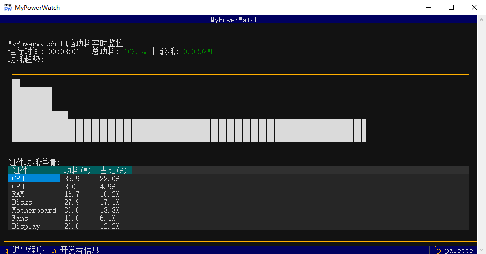

# MyPowerWatch

A lightweight Windows power monitoring tool with terminal UI.

## Features

- Real-time power consumption monitoring for CPU, GPU, RAM and other components
- ASCII-based power trend visualization
- Energy consumption calculation
- Hardware specifications detection
- Windows notifications for high power usage

## Usage

Run the application and monitor your system's power usage in real-time.

Keyboard shortcuts:
- `q` or `Ctrl+C` - Quit the application
- `h` - Show developer information

## Requirements

- Windows 10/11
- Python 3.8+ (if running from source)

## Developer

- Developer: Will Zhou
- Company: 汇视创影科技

- First release: 2025-08-16
